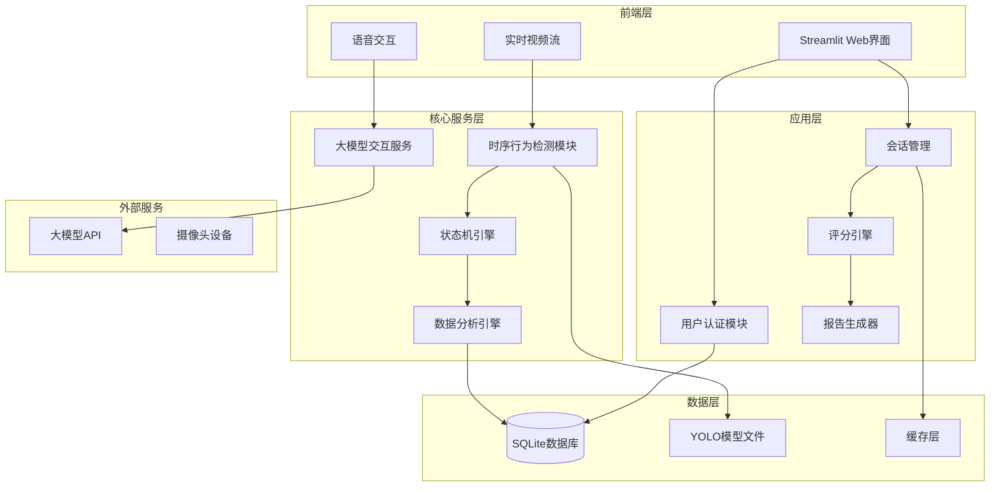

# 设计文档

## 概述

大模型驱动的智能化学实验熟练度评估实时交互系统采用模块化架构设计，基于Python生态系统构建。系统集成了计算机视觉、自然语言处理、统计分析和Web技术，为化学实验学习提供智能化的评估和指导服务。

核心技术栈包括：YOLOv8目标检测、大模型API集成、SQLite数据库、Streamlit Web框架、NumPy/SciPy科学计算库。系统采用事件驱动架构，支持实时视频处理、异步API调用和响应式用户界面。

## 架构

### 系统架构图



### 模块间通信

系统采用事件驱动的消息传递机制，核心组件通过事件总线进行解耦通信：

- **视频处理管道**: Camera → TAD → 状态机 → 评分引擎
- **交互反馈循环**: 用户输入 → LLM服务 → 响应生成 → UI更新
- **数据流向**: 实时数据 → 缓存层 → 数据库 → 报告生成

## 组件和接口

### 1. 用户管理模块 (UserManager)

**核心类**:
```python
class UserManager:
    def register_user(username: str, password: str) -> bool
    def authenticate_user(username: str, password: str) -> Optional[User]
    def save_credentials(username: str, password_hash: str) -> None
    def load_saved_credentials() -> Optional[Tuple[str, str]]

class User:
    user_id: int
    username: str
    password_hash: str
    created_at: datetime
    last_login: datetime
```

**接口规范**:
- 输入验证：用户名长度3-20字符，密码强度检查
- 密码加密：使用bcrypt进行哈希存储
- 会话管理：JWT令牌机制，24小时有效期

### 2. 时序行为检测模块 (TAD)

**核心类**:
```python
class TemporalActionDetector:
    def __init__(self, model_path: str)
    def detect_objects(self, frame: np.ndarray) -> List[Detection]
    def track_temporal_changes(self, detections: List[Detection]) -> List[Action]
    def analyze_action_sequence(self, actions: List[Action]) -> ExperimentStep

class Detection:
    class_id: int
    confidence: float
    bbox: Tuple[int, int, int, int]
    timestamp: float

class Action:
    action_type: str
    start_time: float
    end_time: float
    involved_objects: List[str]
    confidence: float

class ExperimentStep:
    step_name: str
    start_timestamp: float
    end_timestamp: float
    duration: float
    pause_duration: float
    anomalies: List[str]
    sequence_order: int
```

**YOLO集成**:
- 模型：YOLOv8n针对化学实验器材优化训练
- 检测类别：烧杯、试管、滴管、搅拌棒、天平、手部动作等
- 推理性能：≥15 FPS，置信度阈值0.5

### 3. 实时交互评估模块 (LLMService)

**核心类**:
```python
class LLMInteractionService:
    def __init__(self, api_key: str, model_name: str)
    def provide_guidance(self, context: ExperimentContext) -> str
    def analyze_performance(self, session_data: SessionData) -> PerformanceAnalysis
    def generate_recommendations(self, user_profile: UserProfile) -> List[str]

class ExperimentContext:
    current_step: str
    detected_actions: List[Action]
    user_questions: List[str]
    error_count: int
    elapsed_time: float

class PerformanceAnalysis:
    error_types: List[str]
    question_frequency: float
    operation_quality_score: float
    safety_compliance: bool
```

### 4. 评分引擎 (ScoringEngine)

**核心类**:
```python
class ScoringEngine:
    def calculate_s1_time_score(self, actual_time: float, mu: float, sigma: float) -> float
    def calculate_s2_performance_score(self, performance_data: PerformanceAnalysis) -> float
    def compute_final_score(self, s1: float, s2: float) -> float
    def get_experiment_statistics(self, experiment_type: str) -> Tuple[float, float]

class ScoreResult:
    s1_time_score: float
    s2_performance_score: float
    final_score: float
    percentile_rank: float
    calculation_details: Dict[str, Any]
```

**评分算法实现**:
```python
def calculate_s1_time_score(self, actual_time: float, mu: float, sigma: float) -> float:
    """
    计算时长得分 S1 = f(t) = 2 - 2Φ((μ-t)/σ)
    """
    from scipy.stats import norm
    z_score = (mu - actual_time) / sigma
    percentile = norm.cdf(z_score)
    return 2 - 2 * percentile
```

## 数据模型

### 数据库架构

```sql
-- 用户表
CREATE TABLE users (
    user_id INTEGER PRIMARY KEY AUTOINCREMENT,
    username VARCHAR(50) UNIQUE NOT NULL,
    password_hash VARCHAR(255) NOT NULL,
    created_at TIMESTAMP DEFAULT CURRENT_TIMESTAMP,
    last_login TIMESTAMP
);

-- 实验会话表
CREATE TABLE experiment_sessions (
    session_id INTEGER PRIMARY KEY AUTOINCREMENT,
    user_id INTEGER REFERENCES users(user_id),
    experiment_type VARCHAR(100) NOT NULL,
    start_time TIMESTAMP NOT NULL,
    end_time TIMESTAMP,
    total_duration REAL,
    s1_score REAL,
    s2_score REAL,
    final_score REAL,
    video_path VARCHAR(255),
    status VARCHAR(20) DEFAULT 'active'
);

-- 实验步骤表
CREATE TABLE experiment_steps (
    step_id INTEGER PRIMARY KEY AUTOINCREMENT,
    session_id INTEGER REFERENCES experiment_sessions(session_id),
    step_name VARCHAR(100) NOT NULL,
    start_timestamp REAL NOT NULL,
    end_timestamp REAL NOT NULL,
    duration REAL NOT NULL,
    pause_duration REAL DEFAULT 0,
    sequence_order INTEGER NOT NULL,
    anomalies TEXT,
    detected_objects TEXT
);

-- 交互记录表
CREATE TABLE interaction_logs (
    log_id INTEGER PRIMARY KEY AUTOINCREMENT,
    session_id INTEGER REFERENCES experiment_sessions(session_id),
    timestamp REAL NOT NULL,
    interaction_type VARCHAR(50) NOT NULL,
    user_input TEXT,
    system_response TEXT,
    context_data TEXT
);

-- 实验统计表
CREATE TABLE experiment_statistics (
    stat_id INTEGER PRIMARY KEY AUTOINCREMENT,
    experiment_type VARCHAR(100) NOT NULL,
    mean_duration REAL NOT NULL,
    std_deviation REAL NOT NULL,
    sample_count INTEGER NOT NULL,
    last_updated TIMESTAMP DEFAULT CURRENT_TIMESTAMP
);
```

### 数据流模型

```python
@dataclass
class VideoFrame:
    frame_data: np.ndarray
    timestamp: float
    frame_id: int

@dataclass
class DetectionResult:
    detections: List[Detection]
    frame_timestamp: float
    processing_time: float

@dataclass
class SessionState:
    session_id: str
    user_id: int
    current_step: str
    start_time: float
    accumulated_steps: List[ExperimentStep]
    interaction_history: List[InteractionLog]
    real_time_score: float
```

## 正确性属性

*属性是一个特征或行为，应该在系统的所有有效执行中保持为真——本质上，是关于系统应该做什么的正式陈述。属性作为人类可读规范和机器可验证正确性保证之间的桥梁。*

### 属性 1: 用户认证一致性
*对于任何*有效的用户凭据，成功认证后的用户会话应该能够访问所有授权功能，且会话状态在整个使用期间保持一致
**验证需求: 需求 1.4, 1.5**

### 属性 2: 评分算法数学正确性  
*对于任何*实验时长t和统计参数(μ, σ)，S1得分计算f(t) = 2 - 2Φ((μ-t)/σ)应该返回[0, 2]范围内的数值，且最终得分S = 0.7 × S1 + 0.3 × S2应该在[0, 2]范围内
**验证需求: 需求 2.3, 2.4, 2.6, 需求 7.1, 7.3**

### 属性 3: 时序检测数据完整性
*对于任何*检测到的实验步骤，记录的时间戳应该满足start_timestamp < end_timestamp，且步骤序列应该按时间顺序排列
**验证需求: 需求 3.4, 需求 8.3**

### 属性 4: 实时交互响应性
*对于任何*用户交互请求，系统应该在5秒内提供响应，且大模型API调用失败时应该有适当的降级处理
**验证需求: 需求 2.2, 需求 2.5**

### 属性 5: 数据持久化一致性
*对于任何*完成的实验会话，所有相关数据（步骤记录、交互日志、评分结果）应该完整保存到数据库，且数据关系保持一致性
**验证需求: 需求 4.1, 需求 4.2, 需求 5.1, 需求 5.2**

### 属性 6: YOLO检测稳定性
*对于任何*输入视频帧，YOLO模型应该在合理的置信度阈值下提供稳定的检测结果，且检测精度应该满足系统要求
**验证需求: 需求 3.1, 需求 3.2, 需求 3.6**

### 属性 7: 状态机逻辑正确性
*对于任何*实验步骤序列，状态机应该正确识别有效的状态转换，且不应该产生逻辑上不可能的步骤组合
**验证需求: 需求 3.3, 需求 8.4**

### 属性 8: 报告生成完整性
*对于任何*完成的实验会话，生成的报告应该包含所有必需的信息元素（操作步骤、时间分析、评分详情），且推荐算法应该基于用户的实际表现数据
**验证需求: 需求 4.1, 需求 4.3, 需求 4.5**

## 错误处理

### 异常分类和处理策略

**1. 系统级异常**
- 数据库连接失败：自动重试机制，最多3次
- 模型加载失败：降级到备用模型或提示用户
- 内存不足：清理缓存，优化资源使用

**2. 业务逻辑异常**
- 用户认证失败：记录日志，返回友好错误信息
- 评分计算异常：使用默认参数，标记异常状态
- 视频处理中断：保存当前进度，支持恢复

**3. 外部服务异常**
- 大模型API超时：使用缓存响应或简化回复
- 摄像头设备异常：提示用户检查设备连接
- 网络连接问题：离线模式支持

### 错误恢复机制

```python
class ErrorHandler:
    def handle_api_timeout(self, context: str) -> str:
        """处理API超时，返回预设响应"""
        return self.get_cached_response(context) or "系统正在处理中，请稍候..."
    
    def handle_detection_failure(self, frame: np.ndarray) -> List[Detection]:
        """处理检测失败，返回空检测结果"""
        logger.warning("Detection failed, returning empty results")
        return []
    
    def handle_database_error(self, operation: str, data: Any) -> bool:
        """处理数据库错误，尝试重连和重试"""
        for attempt in range(3):
            try:
                self.reconnect_database()
                return self.retry_operation(operation, data)
            except Exception as e:
                logger.error(f"Database retry {attempt + 1} failed: {e}")
        return False
```

## 测试策略

### 双重测试方法

系统采用单元测试和基于属性的测试相结合的综合测试策略：

**单元测试**覆盖：
- 具体的功能示例和边界条件
- 组件间的集成点
- 错误处理和异常情况

**基于属性的测试**验证：
- 应该在所有输入中保持的通用属性
- 数学算法的正确性
- 系统行为的一致性

### 属性测试框架

使用Python的`hypothesis`库进行基于属性的测试：

```python
from hypothesis import given, strategies as st
import hypothesis.strategies as st

@given(st.floats(min_value=0.1, max_value=1000.0),
       st.floats(min_value=0.1, max_value=100.0),
       st.floats(min_value=0.1, max_value=50.0))
def test_scoring_algorithm_bounds(actual_time, mu, sigma):
    """**特征: ai-chemistry-lab-assessment, 属性 2: 评分算法数学正确性**"""
    engine = ScoringEngine()
    s1_score = engine.calculate_s1_time_score(actual_time, mu, sigma)
    assert 0 <= s1_score <= 2, f"S1 score {s1_score} out of bounds [0, 2]"

@given(st.lists(st.floats(min_value=0.0, max_value=1000.0), min_size=2, max_size=10))
def test_temporal_ordering(timestamps):
    """**特征: ai-chemistry-lab-assessment, 属性 3: 时序检测数据完整性**"""
    steps = create_experiment_steps(timestamps)
    for i in range(len(steps) - 1):
        assert steps[i].start_timestamp <= steps[i+1].start_timestamp
        assert steps[i].start_timestamp < steps[i].end_timestamp
```

### 测试配置

- 属性测试最小运行100次迭代
- 每个正确性属性对应一个独立的属性测试
- 测试标记格式：`**特征: {feature_name}, 属性 {number}: {property_text}**`
- 集成测试覆盖端到端工作流程
- 性能测试确保实时处理要求（≥15 FPS）